# SIMPLE DOCKER

# Содержание

1. [Часть 1 Готовый DOCKER](#часть-1-готовый-docker)
2. [Часть 2 Операции с контейнером](#часть-2-операции-с-контейнером)
3. [Часть 3 Мини веб-сервер](#часть-3-мини-веб-сервер)
4. [Часть 4 Свой докер](#часть-4-свой-докер)
5. [Часть 5 **Dockle**](#часть-5-dockle)
6. [Часть 6 Базовый **Docker Compose**](#часть-6-базовый-docker-compose)

## Часть 1 Готовый DOCKER

Возьмём официальный докер образ с nginx и выкачаем его при помощи docker pull
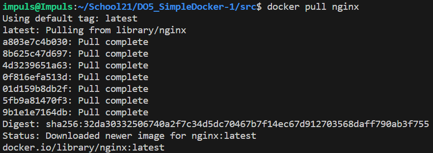
- в терминале наберём: docker pull nginx
*************************************************************************************************************************
Проверим наличие докер образа через docker images
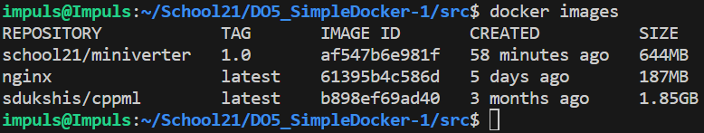
- в терминале наберём: docker images
*************************************************************************************************************************
Запустим докер образ через docker run -d и проверим, что образ запустился через docker ps. Посмотрим информацию о контейнере через docker inspect
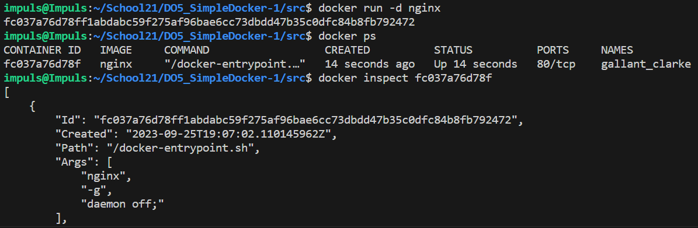
- в терминале наберём: docker run -d nginx, docker ps и docker inspect fc037a76d78f
*************************************************************************************************************************
По выводу команд определим:
1. размер контейнера - 187 МВ
2. список замапленных портов - "80/tcp": null 
3. ip контейнера - 172.17.0.2

- docker inspect fc037a76d78f -> "80/tcp": null, IP - 172.17.0.2
*************************************************************************************************************************
Остановим докер образ через docker stop
Проверим, что образ остановился через docker ps
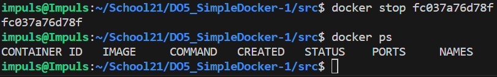
- в терминале наберём: docker stop fc037a76d78f а затем docker ps
*************************************************************************************************************************
При запуске Docker на 80 порту, он может быть занят. Удалим все задачи, запущенные на 80 порту и запустим докер с портами 80 и 443 в контейнере, замапленными на такие же порты на локальной машине, через команду run
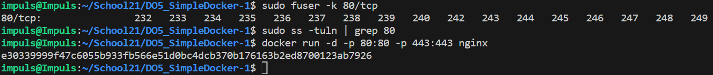
- в терминале наберём: fuser -k 80/tcp, проверим что задействованных задач на 80 порту нет и -> docker run -d -p 80:80 -p 443:443 nginx
*************************************************************************************************************************
Проверим, что в браузере по адресу localhost:80 доступна стартовая страница nginx

- в браузере -> localhost:80
*************************************************************************************************************************
Перезапустим докер контейнер через docker restart
Проверим, что контейнер запустился
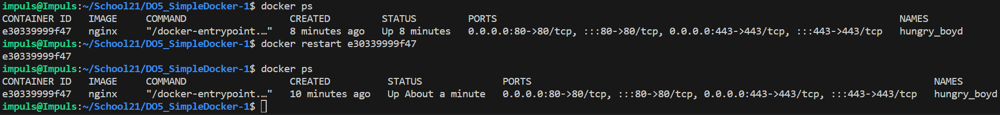
- в терминале наберём: docker ps -> docker restart e30339999f47 -> docker ps
*************************************************************************************************************************
[Вернуться к содержанию](#содержание)

## Часть 2. Операции с контейнером

Прочитаем конфигурационный файл nginx.conf внутри докер контейнера через команду exec:
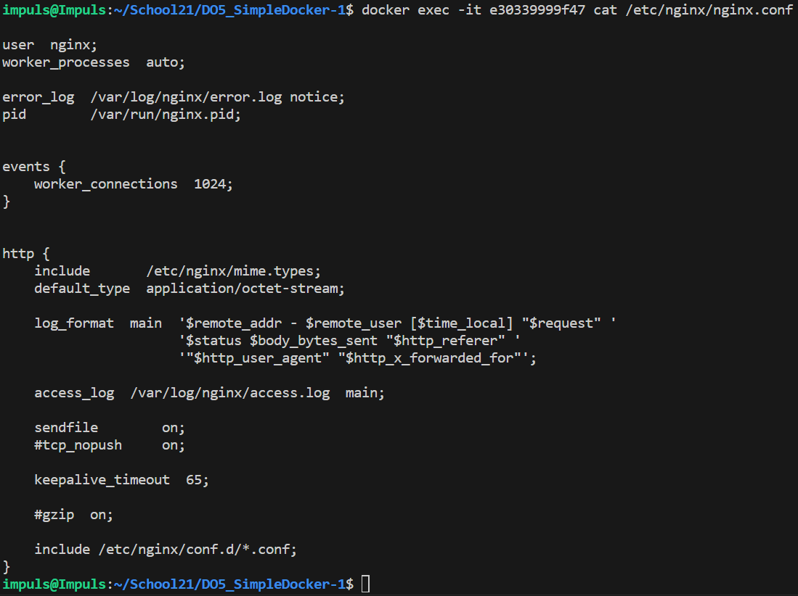
- в терминале наберём: docker exec -it e30339999f47 cat /etc/nginx/nginx.conf
*************************************************************************************************************************
Создадим на локальной машине файл *nginx.conf*
Настроим в нем по пути */status* отдачу страницы статуса сервера **nginx**
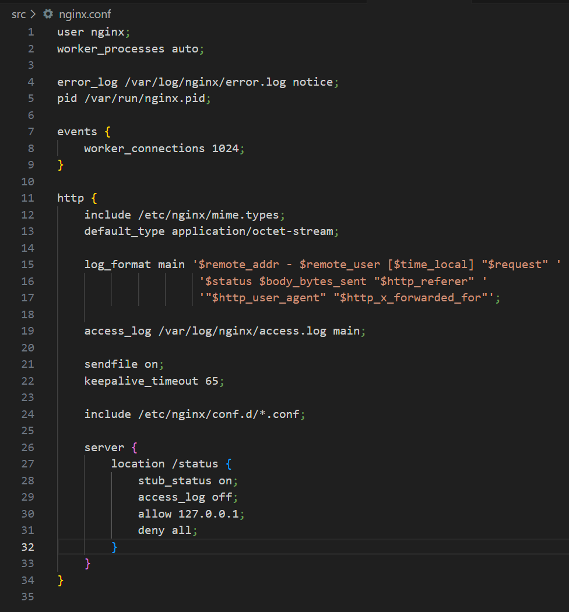
- Отредактированныйй файл nginx.conf
*************************************************************************************************************************
Скопируем созданный файл *nginx.conf* внутрь докер образа через команду `docker cp` и перезапустим nginx
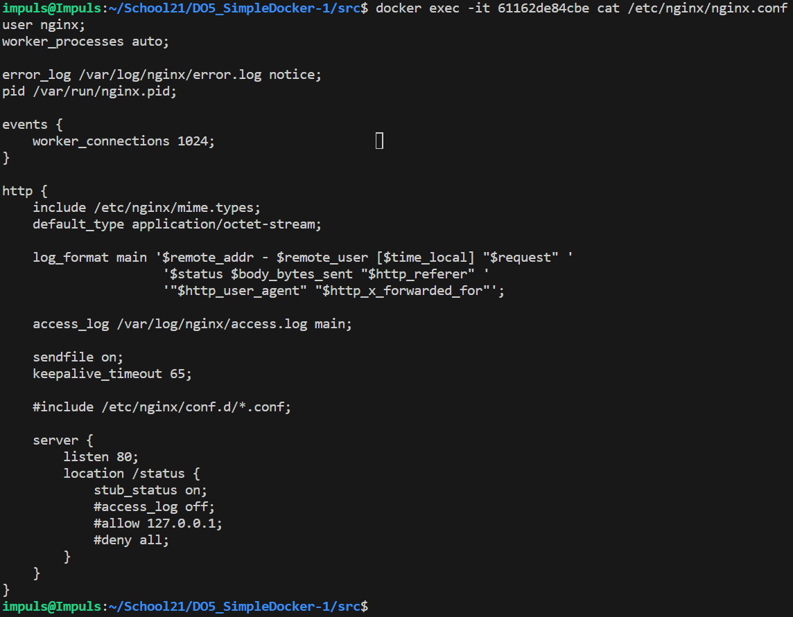
- docker cp 61162de84cbe:/etc/nginx/nginx.conf ./nginx.conf -> docker exec -it 61162de84cbe nginx -s reload
*************************************************************************************************************************
Проверим, что по адресу localhost:80/status отдается страничка со статусом сервера nginx
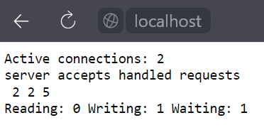
- в браузере -> localhost:80/status
*************************************************************************************************************************
Экспортируем контейнер в файл *container.tar* через команду *export*
Остановим контейнер
Удалим образ через `docker rmi [image_id|repository]`, не удаляя перед этим контейнеры
Удалим остановленный контейнер
Импортируем контейнер обратно через команду *import*
Запустим импортированный контейнер
Проверим, что по адресу *localhost:80/status* отдается страничка со статусом сервера **nginx**
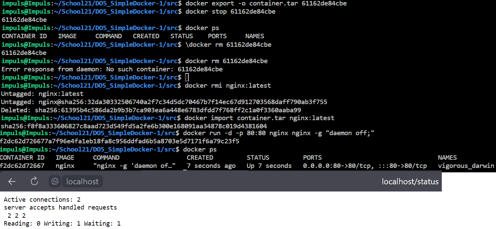
- все вышеперечисленные действия выполнены
*************************************************************************************************************************
[Вернуться к содержанию](#содержание)

## Часть 3. Мини веб-сервер

Последовательность действий для создания мини веб-сервера:
1. Пишем код в файле manaserver.c - который представляет собой FastCGI-приложение, которое при каждом запросе от клиента отправляет одну и ту же HTML-страницу с двумя заголовками "Hello World!".
2. ->  gcc -o miniserver miniserver.c -lfcgi
3. Пишем  конфигурационный файл Nginx, который представляет базовую настройку для сервера и включает настройки для логирования, обработки HTTP-запросов и оптимизации соединений.
4. Копируем этот конфиг в ./nginx/nginx.conf на локальной машине
5. Перезагрузим config: -> sudo systemctl restart nginx
6. Для запуска сервера -> spawn-fcgi -p 8080 -n ./miniserver

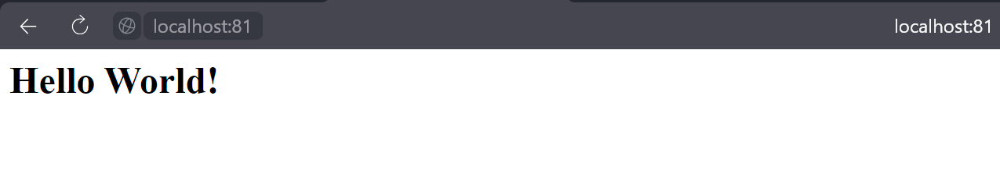
- Запускаем браузер на странице localhost:81
*************************************************************************************************************************
[Вернуться к содержанию](#содержание)

## Часть 4. Свой докер
 -> docker build -t miniserver:1.0 .
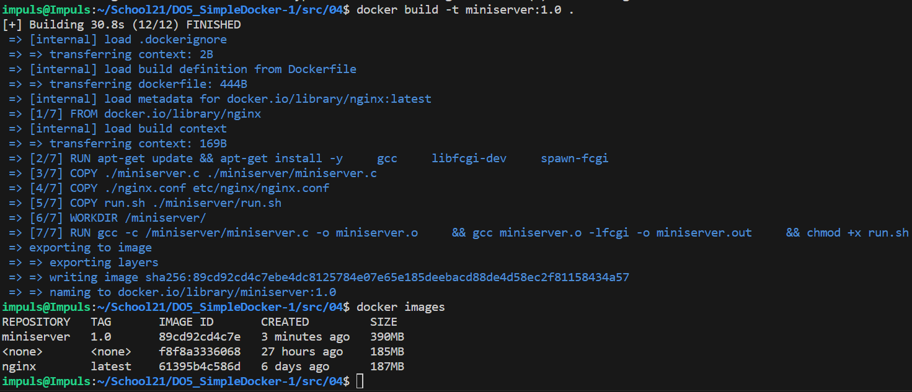
- собираем контейнер
************************************************************************************************************************* -> docker run -dt -p 80:81 -v $(pwd)/../server/nginx.conf:/etc/nginx/nginx.conf miniserver:1.0
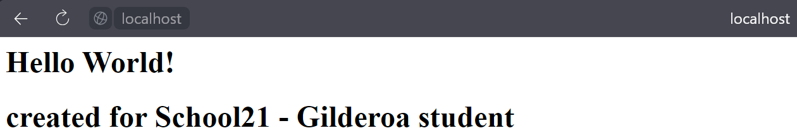
- Запустилась стартовая страничка
*************************************************************************************************************************
Допишем в *./nginx/nginx.conf* проксирование странички */status*, по которой надо отдавать статус сервера **nginx**
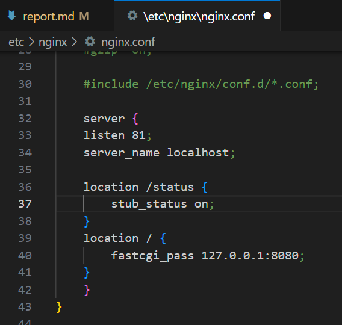
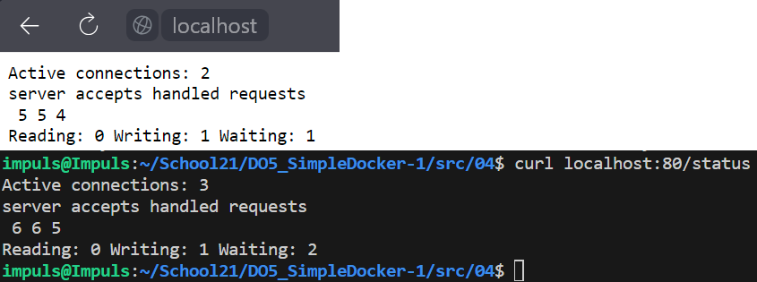
- -> curl localhost:80/status
*************************************************************************************************************************
Перезапускаем Docker
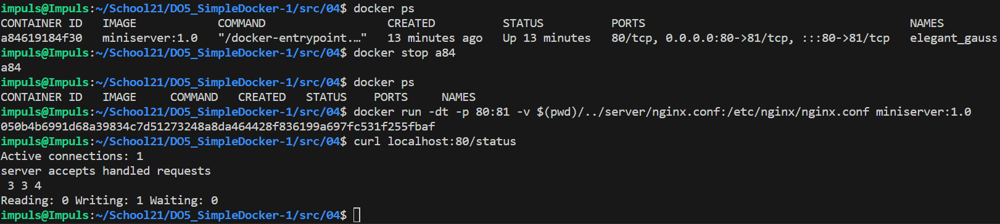
*************************************************************************************************************************
[Вернуться к содержанию](#содержание)

## Часть 5 **Dockle**

1. Посмотрим ошибки
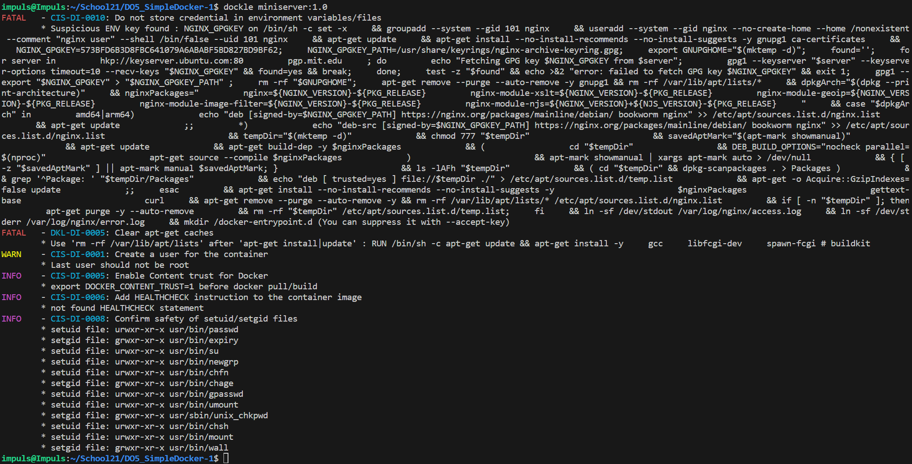
- -> dockle miniserver:1.0
*************************************************************************************************************************
2. Вносим изменения в Dockerfile: добавляем очистку скачанных архивов и исполнение файлов от имени dockeruser
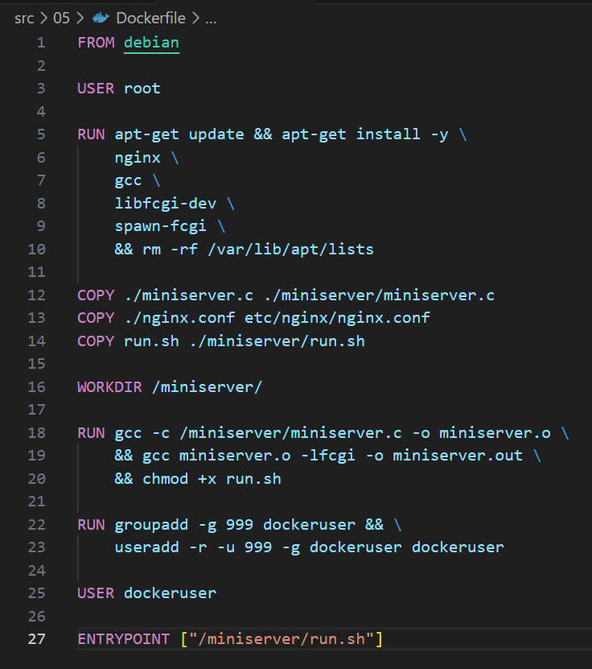
- -> Скрин исправленного Dockerfile
*************************************************************************************************************************
3. Собираем miniserver v2.0 и выполняем dockle
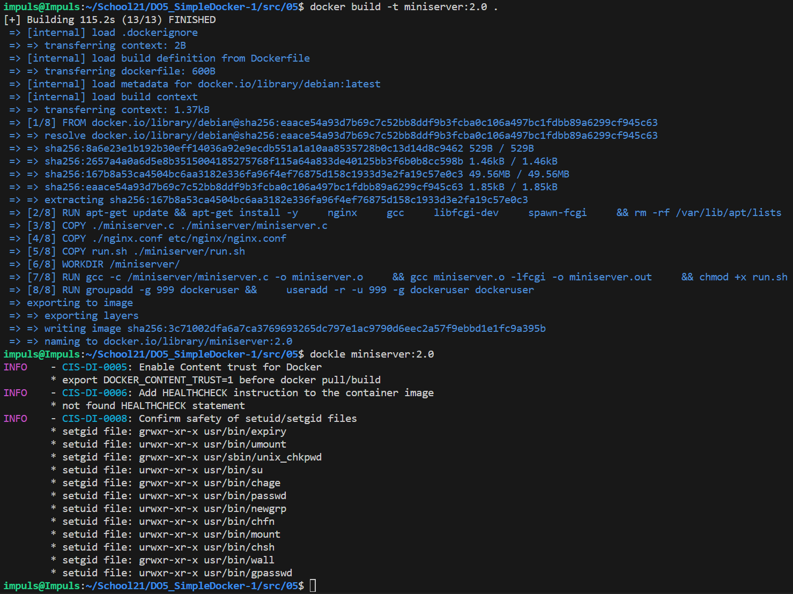
- -> docker build -t miniserver:2.0 .
-> dockle miniserver:2.0
*************************************************************************************************************************
[Вернуться к содержанию](#содержание)

## Часть 6 Базовый **Docker Compose**

1. Скопируем и соберём образы (из 05 задания и nginx с нашими настройками): 
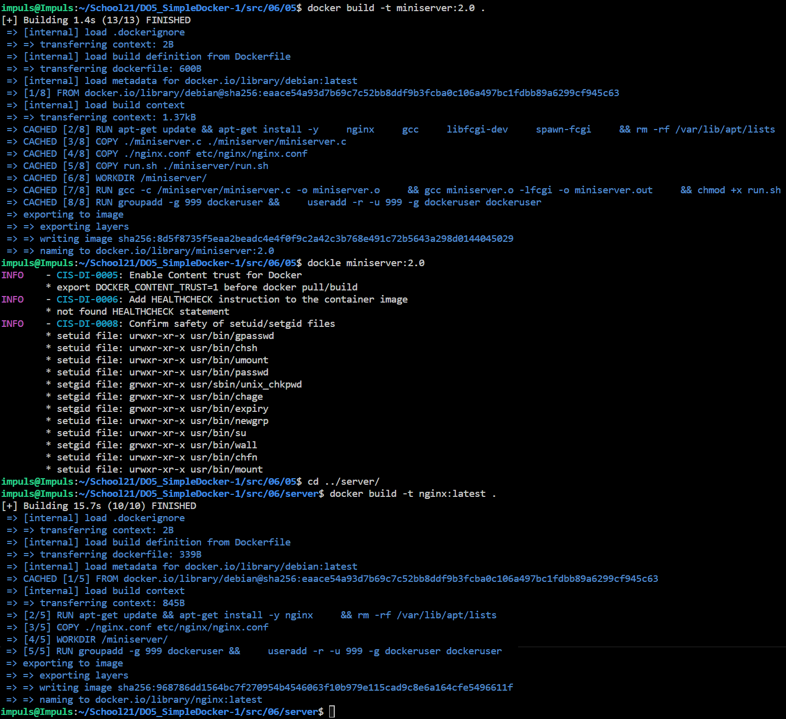
- -> docker build -t miniserver:2.0 .
- -> docker build -t nginx:latest .
*************************************************************************************************************************
2. Соберём docker-compose и запустим
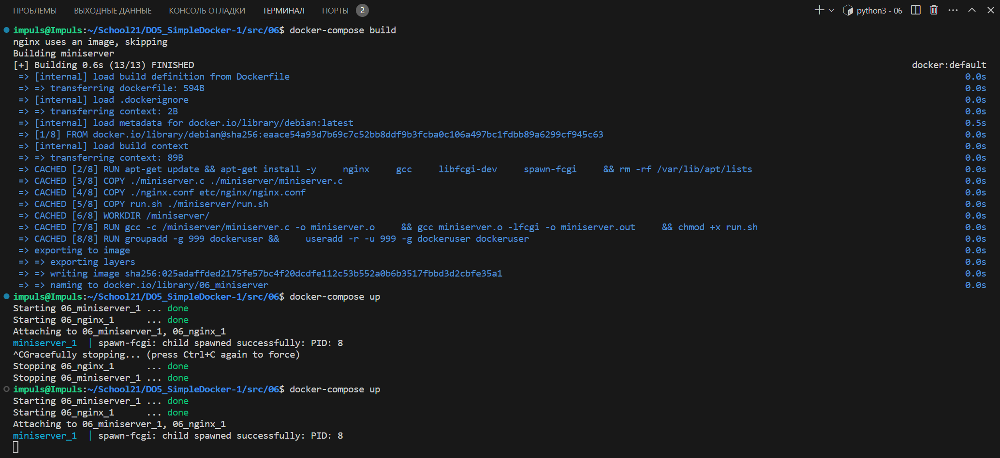
- -> docker-compose build
- -> docker-compose up
*************************************************************************************************************************
[Вернуться к содержанию](#содержание)