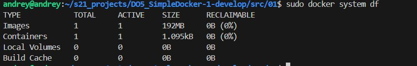
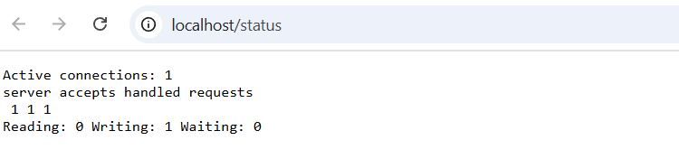
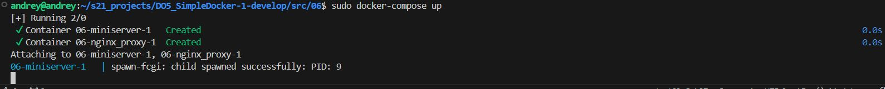

# Отчет по заданию DO5_SimpleDocker-1

## Part 1. Готовый Docker

Возьмём официальный докер образ с nginx и скачаем его при помощи команды **docker pull nginx**

*************************************************************************************************************************
Проверим наличие докер образа через команду **docker images**

*************************************************************************************************************************
Запустим обрраз nginx с помощью команды  **docker run -d nginx** и проверим, что образ запустился через команду **docker ps**. 
Ключ **-d** используется для запуска контейнера в фоновом режиме. Это позволяет контейнеру продолжать работу без привязки к текущему терминалу или сессии командной строки.

Посмотрим информацию о контейнере c помощью команды **docker inspect**.

Чтобы узнать список замапленных портов и IP адрес контейнера, найдем строки "Ports" и "IPAddress"

Чтобы узнать размер образа, можно применить команду **docker system df**

*************************************************************************************************************************
По выводу команд определим:
 - размер контейнера - 1095kB
 - список замапленных портов - "80/tcp": null 
 - ip контейнера - 172.17.0.2
 

*************************************************************************************************************************
Остановим докер образ через команду  **docker stop**
Проверим, что образ остановился через команду  **docker ps**

*************************************************************************************************************************
- введем команды **fuser -k 80/tcp** чтобы проверить, что задействованных задач на 80 порту нет.
- Запуститм докер с портами 80 и 443 в контейнере, замапленными на такие же порты на локальной машине, через команду **docker run -d -p 80:80 -p 443:443 nginx**

*************************************************************************************************************************
Проверим, что в браузере по адресу localhost:80 доступна стартовая страница nginx, для этого в браузере введем **localhost:80**

*************************************************************************************************************************
Перезапустим контейнер через команду **docker restart a5dde1903b10**
Проверим, что контейнер запустился командой **docker ps**

*************************************************************************************************************************

## Часть 2. Операции с контейнером

Выведем на экран содержание конфигурационного файла **nginx.conf** внутри докер контейнера через команду **docker exec -it a5dde1903b10 cat /etc/nginx/nginx.conf**

*************************************************************************************************************************
Создадим на локальной машине файл **nginx.conf**
Настроим в нем по пути */status* отдачу страницы статуса сервера **nginx** и закомментируем строку include

*************************************************************************************************************************
Скопируем созданный файл **nginx.conf** внутрь докер образа через команду **docker cp nginx.conf a5dde1903b10:/etc/nginx/nginx.conf** и перезапустим сервер nginx коммнандой **docker exec -it a5dde1903b10 nginx -s reload**

 
*************************************************************************************************************************
Введем в браузере **localhost:80/status** и проверим, что отдается страничка со статусом сервера nginx

*************************************************************************************************************************
Далее, в соответствии с заданием
 - Экспортируем контейнер в файл *container.tar* через команду **sudo docker export a5dde1903b10>container.tar**
 - Остановим контейнер коммандой **docker stop a5dde1903b10**
 - Удалим образ через **docker rmi -f 7a5dde1903b10**, не удаляя перед этим контейнеры
 - Удалим остановленный контейнер командой **docker rmi nginx: latest**
 - Импортируем контейнер обратно через команду **docker import container.tar nginx: latest**
 - Запустим импортированный контейнер командой **docker run -d -p 80:80 nginx nginx -g "daemon off;"**
 

Проверим, что по адресу *localhost:80/status* отдается страничка со статусом сервера **nginx**

*************************************************************************************************************************

## Часть 3. Мини веб-сервер

Последовательность действий для создания мини веб-сервера, при этом нужно установить nginx в систему:
1. Пишем код в файле **manaserver.c** - который представляет собой FastCGI-приложение, которое при каждом запросе от клиента отправляет HTML-страницу с заголовком "Hello World!"
2. Выполним команду **gcc -o miniserver miniserver.c -lfcgi**, предварительно установив соответсвующие пакеты
3. Наишем  конфигурационный файл nginx, который будет проксировать все запросы с 81 порта на 127.0.0.1:8080 

4. Копируем этот конфиг в **./nginx/nginx.conf** на локальной машине
5. Выполним команду **sudo systemctl restart nginx** для перезагрузки конфигурации
6. Выполним команду **spawn-fcgi -p 8080 -n ./miniserver** для запуска сервера, предварительно установив spawn-fcgi

- Запускаем браузер на странице localhost:81

*************************************************************************************************************************

## Часть 4. Свой докер

Напишем свой докер образ, который:

1) собирает исходники мини сервера на FastCgi из Части 3
2) запускает его на 8080 порту
3) копирует внутрь образа написанный ./nginx/nginx.conf
4) запускает nginx.

 Собираем контейнер командой **docker build -t miniserver:1.0 .**

************************************************************************************************************************* 
Запустим контейнер **docker run -dt -p 80:81 -v $(pwd)/../server/nginx.conf:/etc/nginx/nginx.conf miniserver:1.0**

Проверим в браузере

*************************************************************************************************************************
Допишем в **./nginx/nginx.conf** проксирование странички **/status**, по которой надо отдавать статус сервера **nginx**

*************************************************************************************************************************
Перезапускаем Docker

Проверим, что в браузере при вызове **localhost:80/status**  выводится статус сервера

*************************************************************************************************************************

## Часть 5 **Dockle**

 Посмотрим ошибки c помощью команды **dockle miniserver:1.0**

*************************************************************************************************************************
 Вносим изменения в Dockerfile: добавляем очистку скачанных архивов и исполнение файлов от имени dockeruser

*************************************************************************************************************************
Собираем miniserver v2.0 и выполняем dockle

*************************************************************************************************************************

## Часть 6 Базовый **Docker Compose**

Скопируем и соберём образы (из задания Part 5 и nginx): 

*************************************************************************************************************************
Соберём docker-compose при помощи команды **docker-compose build** и запустим командой **docker-compose up**
 

*************************************************************************************************************************
Проверим, что в браузере по адресу **localhost:80** доступна  HTML-страница с заголовком "Hello World!"

*************************************************************************************************************************